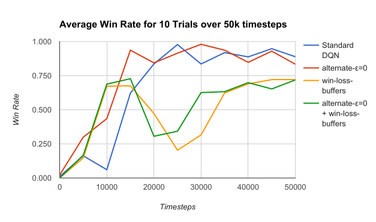

# TensorFlow and StarCraft

* [Background](#background)
   * [StarCraft](#starcraft)
   * [AI research with StarCraft](#ai-research-with-starcraft)
   * [BWAPI](#bwapi)
   * [Torch](#torch)
   * [TensorFlow](#tensorflow)
   * [TorchCraft](#torchcraft)
* [This project](#this-project)
   * [1. Python Client for BWAPI](#1-python-client-for-bwapi)
   * [2. StarCraft TensorFlow agent examples](#2-starcraft-tensorflow-agent-examples)
   * [3. A DQN for solving a difficult binary-success problem in StarCraft (that is, a DQN for a kiting micro-battle).](#3-a-dqn-for-solving-a-difficult-binary-success-problem-in-starcraft-that-is-a-dqn-for-a-kiting-micro-battle)
      * [Abstract](#abstract)
      * [Introduction](#introduction)
      * [Environment and Parameterization](#environment-and-parameterization)
      * [Reward Policy](#reward-policy)
      * [Algorithm](#algorithm)
      * [Results](#results)
      * [Conclusions](#conclusions)
      * [Future Work](#future-work)
      * [Implementation](#implementation)
      * [References](#references)

## Background

### StarCraft

- [StarCraft](https://en.wikipedia.org/wiki/StarCraft_(video_game)): A 1998 Real-Time strategy game. Used in lots of AI research, and also has a [strong professional competetive following](https://en.wikipedia.org/wiki/Professional_StarCraft_competition) in Korea worth ~millions of USD.
- [Brood War](https://en.wikipedia.org/wiki/StarCraft:_Brood_War): The expansion pack for StarCraft.

All professional competition and research with StarCraft these days uses the Brood War expansion.

### AI research with StarCraft

Recent examples:
- [Usunier et al, 2016](https://arxiv.org/abs/1609.02993), Episodic Exploration for Deep Deterministic Policies:
An Application to StarCraft Micromanagement Tasks
- [Foerster et al, 2017](https://arxiv.org/abs/1702.08887), Stabilising Experience Replay for Deep Multi-Agent Reinforcement Learning

### BWAPI

The Brood War Application Programming Interface ([BWAPI](https://github.com/bwapi/bwapi)) allows interaction with a StarCraft client through C++ code.

It is implemented as a C++ DLL injected into a running StarCraft client. The user of the API adds code interacting with the BWAPI library, builds a DLL, and runs a tool to inject that into a StarCraft client.

### Torch

[Torch](http://torch.ch/) is a Lua framework for implementing machine learning algorithms, with GPU support.

Torch is open-source, and maintained primarily by Facebook.

### TensorFlow

[TensorFlow](https://www.tensorflow.org/) is an open-source library for machine learning like Torch, but has support in more languages (Python, C++, Java, GO) and more features (e.g. run on a mobile device, Google Cloud Platform).

TensorFlow is maintained by Google's Brain team. TensorFlow left Beta and V1  was published on 15th of Feb, 2017 ([github](https://github.com/tensorflow/tensorflow/releases/tag/v1.0.0), [announcement video](https://www.youtube.com/watch?v=mWl45NkFBOc))

### TorchCraft

[TorchCraft](https://github.com/TorchCraft/TorchCraft) is A bridge between Torch and BWAPI, consisting of:
- A socket server implemented in a C++ BWAPI DLL, that serves the StarCraft game state and takes commands.
- A Lua client for talking to the server.
- Examples of Lua code that implement a StarCraft agent using the Torch machine learning library.

The main advantage of TorchCraft is that one can build a StarCraft agent in a Unix environment.


## This project

1. A Python client for the BWAPI server from TorchCraft.
2. Examples of StarCraft agents implemented using the TensorFlow python libraries.
3. A Deep Q-network to learn the ["kiting"](http://wiki.teamliquid.net/starcraft2/Kiting) mechanic in StarCraft.

### 1. Python Client for BWAPI

In order to the TensorFlow python api in a native Unix environment for building StarCraft AIs, we have written a python client for the TorchCraft C++ server:
- Network IO is generally in [tc_client.py](tc_client.py).
- The TorchCraft server returns the game-state as a Lua object string, which we transform into a python object string and ```eval()``` [here](https://github.com/aedanpope/tc_client/blob/427aafc9aa5dce7561325e74c64f4e8a13905e5e/tc_client.py#L254).
- [state.py](state.py) is responsible for parsing the responses from the server and turning them into typed obejects.
- [exercise.py](exercise.py) shows a ```main()``` function which instantiates a client and sends it commands from an agent.


### 2. StarCraft TensorFlow agent examples

The existing best-class environment for StarCraft research is TorchCraft (used in recent research [[1](https://arxiv.org/abs/1609.02993), [2](https://arxiv.org/abs/1702.08887)]).

TensorFlow support for BWAPI makes writing machine learning agents accessible to everyone who knows TensorFlow, and is a solid long-term investment as TensorFlow grows in popularity and functionality. TensorFlow's [github](https://github.com/tensorflow/tensorflow) has ~10x more commits than [Torch's](https://github.com/torch/torch7).

For example, [Juliani's Q-Learing Part 0 blog post](https://medium.com/emergent-future/simple-reinforcement-learning-with-tensorflow-part-0-q-learning-with-tables-and-neural-networks-d195264329d0#.icolg93n8) cointains sample TensorFlow code for a simple Q-network, which we've implemented to control a starcraft agent in [bot_q_learner_simple_a.py](bot_q_learner_simple_a.py) (the TensorFlow code specifically is [here](https://github.com/aedanpope/tc_client/blob/728ac6b889b1aa702ecea65a7a49bdb99d2625cd/bot_q_learner_simple_a.py#L127)).

### 3. A DQN for solving a difficult binary-success problem in StarCraft (that is, a DQN for a kiting micro-battle).


#### Abstract

Recent research into Reinforcement learning has used _micromanagement battles_ in the the real-time strategy game StarCraft as benchmarks for reinforcement learning algorithms.

In this research, the battles have been between symmetrical forces. Giving no orders in these battles (and thus defaulting to self-defence) can still result in a win 80%+ of the time. However, many micro problems in real StarCraft games require very specific actions to have any chance of success.

When pitting a fast ranged unit vs. a slow melee one in StarCraft, the optimal control strategy for the ranged unit is to _Kite_ the melee one (fire from range, dance backwards before the melee unit can attack, and fire again). Giving no orders in this Battle to the ranged unit is a guaranteed loss.

We construct a simplified battle where kiting is the optimal stragey, and where randomly generating orders from a small but sufficient set results in nominal win rates (~1%). Then we show that the standard DQN algorithm is able to consistently perform well at this battle, sometimes achieving human-level performance. We attempt some intuitive modifications to the DQN (separate buffers for wins & losses, not ε-Greedy exploring in every 2nd episode), and show that emperically these have neutral-to-negative impact on the performance of the algorithm. Generic DQN is hard to beat.

Human Expert winning the micro battle: https://www.youtube.com/watch?v=PnEhLxpL29U

The network learning an optimal strategy over time: https://www.youtube.com/watch?v=UHgK2RxLCKM


#### Introduction
Recent AI research using Q-networks for StarCraft micro has looked primarily at symmetrical battles of groups of Marines. In particular, Marine 5v5 where the opponent just attack-moves the AI controlled 5 marines was studied in [Usunier et al, 2016](https://arxiv.org/abs/1609.02993) and [Foerster et al, 2017](https://arxiv.org/abs/1702.08887). This is a good environment for exploring the multi-agent problem, and extending models to the stochasitc high-dimensional StarCraft space.

There are many challenges to the StarCraft environment that marine 5v5 does not expose us to:
- Exploration complexity: giving _no_ orders to the friendly controlled marines leads to a win rate of 84% (Foerster, 2017), this means that agents have a decent default policy to iteratively learn and improve from.
- Asymmetry: One of the interesting AI challenges of StarCraft is the asymmetry in micro battles and races. There are 3 distint races with very different units and technologies available, leading to 9 different roles a completely general StarCraft AI has to learn (i.e. controlling {Terran, Zerg, Protos} vs enemy {Terran, Zerg, Protoss} is 9 distinct problems to solve with many common features).
- Planning: In marine 5v5, short term gains are a close proxy for long term victory. Doing some extra damage to the opponent this frame is probably good. In both (Foerster et al., 2017) and (Usunier et al., 2016), the agents are rewarded for dealing more damage to the opponent than they take in a timestep. However, In StarCraft it's common to either:
  - Make short term sacrifices to realise a longer term advantage.
  - Realise a short term advantage, without it being clear you've incurred a longer term disadvantage (you have dealt damage to an opponent but moved yourself into a position where you will take a lot more damage shortly).

Consider a battle a [Terran Vulture](http://wiki.teamliquid.net/starcraft/Vulture) and a [Protoss Zealot](http://wiki.teamliquid.net/starcraft/Zealot).

The vulture is a fast, fragile unit with a ranged attack. The zealot is a strong slow-moving unit with a melee attack. If a vulture and a zealot simply move directly to attack each other - the zealot will win.

In professional StarCraft, it is commonly accepted that vultures beat zealots - because expert players will [micro](http://wiki.teamliquid.net/starcraft2/Micro_(StarCraft)#Battle_micro) the vultures to hit the zealot once from range, then dance back before the zealot can attack and hit it again. This techniqe of "dancing back" is called [kiting](http://wiki.teamliquid.net/starcraft2/Kiting). Here is a video of a human controlling a Vulture to consistently beat a Zealot by kiting: https://www.youtube.com/watch?v=PnEhLxpL29U

A kiting micro battle is:
- hard to win with null or random actions
- asymmetrical
- has a slightly longer planning horizion than Marine 5v5

There has been [some previous research](https://scholar.google.co.uk/scholar?hl=en&q=starcraft+kiting&btnG=&as_sdt=1%2C5&as_sdtp=) into kiting in StarCraft using machine learning. Notably (Sukhbaatar et al., 2016), where a generalized gaming agent was able to develope highly successful kiting strategies with reinforcement learning.

In this project we consider the Kiting problem as a exercise to:
- Demonstrating the usefulness of the TensorFlow integration into BWAPI.
- See if a relatively generic Deep Q-learning network can solve the kiting problem (a network largely like that described in (Mnih et al, 2015)).

We are able to achive strong win rates on this problem (89% on average after 50k timesteps, 100% in best trials) with a standard DQN algorithm.

#### Environment and Parameterization

Our environment consits of a simplified 1v1 battle between a vulture and a zealot.

- Zealot: the enemy unit controlled by the environment, ordered to attack directly at the vulture.
- Vulture: the unit controlled by our agent.
- The hit points and damage of the units are modified such that the zealot kills the vulture in one attack, and the vulture kills the zealot in _n_ attacks - where _n_ is a parameter in ℤ<sup>+</sup>. For a particular _n_, we call the environment "_n_-kite". We chose n=2 going forward.
- Starting Positions: The two opposing units start close enough that if the vulture simply attacks the zealot, the zealot will reach it and attack at melee range after the vulture fires one shot. With n >= 2, the vulture must move to survive and ultimately win the battle.
- The vulture has 20 seconds to win the battle, otherwise the zealot wins by default.

Each timestep for the agent consists of 5 frames of the game.

We parameterise the enivornment for input into the network as follows (see [agent.py](agent.py)):

- For both units (all normalized to range [0,1])
  - x and y positional coordinates (normalized within a bounding box)
  - current life of the unit
  - [cooldown](http://wiki.teamliquid.net/starcraft/Game_Speed#Cooldown) of the unit's attack, that is how long until it's attack is ready.

- For the agent controlled vulture, we also pass a one-hot vector of what order type the unit is currently following from {Guard, Move, Attack}.
- We pass the values of the above for the current & previous timesteps (so that the network can determine velocity of both units). The standard DQN passes 4 frames of the Atari game.

The output of the agent is a one-hot vector representing 6 possible orders:
- Give no order, so the vulture continues with its current order.
- Give an order to move 6 tiles in 4 possible directions {up, down, left right}. It will take more than one timestep to finish moving the 6 tiles.
- Give an order to attack the enemy zealot. The vulture will move towards the zealot until it is in range, then fire, and pursue indefinitely.

If the vulture is currently standing still, then it defaults to the "guard" order, meaning that it will attack and pursue any enemy that comes within range.


#### Reward Policy

We give the agent a binary +1 or -1 reward at the end of the battle depending on if it wins or loses. This is the only reward the agent gets, so it is encouraged to plan ahead for long term reward.

Unlike (Foerster et al., 2017) and (Usunier et al., 2016), we do not give the agent any partial rewards for dealing more damage to the opponent than they take in a given timestep. We originally experimented with this, but found that the agent would get stuck in greedy local optima, where it would fire at the zealot but not run away in time - happy with the small reward it had incurred. Attempting to explicitly reward incurring damage in one timestep and not suffering damage within a set number of future timesteps trained the agent to be too risk adverse, not moving in to kill off the opponent.


#### Algorithm

We use a deep neural network to approximate the optimal action-value function:

_Q(s,a)_ = reward for taking action _a_ in state _s_ plus all discounted future reward (so the best action a in a state s is the one such that Q(s,a) is maximum)

Network Topology:
- 23 input nodes
- fully connected hidden layer of size 200, activation function ReLU
- fully connected hidden layer of size 300, activation function ReLU
- 6 output nodes, activation function TanH (from (Lillicrap et al., 2015))

We consider two tweaks to the standard DQN algorithm:
- Separate buffers for storing experience from won and loss episodes: intuitively to make sure the agent trains at some experience from the 1% of randomly won battles, and doesn't just train losses.
- Set ε=0 in every 2nd episode: In some trials it was observed that performance would degrade from high win rates early on (e.g. 98% at 10k time steps), to completely losing when performance was measured again 5k steps later (0% win rate). By performing every second episode using the current "best known strategy" we hoped the algorithm would more quickly unlearn these regressions.

Algorithm including both tweaks:

```
Initialize win experience buffer W to capacity N_w
Initialize lose experience buffer L to capacity N_l
Initialize action-value function Q with random weights θ
Initialize target action-value function Q_2 with random weights θ_2

For battle 1, ... do
  Initialise battle buffer E
  while battle_not_over do
    read state s from battle
    if (battle <= K)
      select random action a
    else
      if (battle % 2 == 1 and random(0,1) <  ε)
        select a = random choice
      otherwise select a = argmax_a_i Q(s, a_i, θ)
    execute a on battle
    read state s1 from battle
    set r to 1 if battle is won, -1 if lost, 0 otherwise.
    store transition (s, a, r, s1) in E
    if (battle > K)
      select B = T/2 random samples each from W and L
      For each experience (s, a, r, s1) in B
        set a1 = argmax_a_i Q(s1, a_i, θ)
        set q1 = Q_2(s1, a1, θ_2)
        set y = r + γ * q1
        Update θ for loss (y - Q(s, a, θ))^2 with learning rate λ using Adam gradient-descent algorithm
        Set θ_2 = τ*θ + (1-τ)*θ_2
  End For
  if battle was won
    append E to W
  else
    append E to L
End For
```

We use the Adam gradient-descent algorithm for training the network ([Kingma et. al., 2014](https://arxiv.org/abs/1412.6980)) (also see TensorFlow [tf.train.AdamOptimizer](https://www.tensorflow.org/api_docs/python/tf/train/AdamOptimizer).

Hyperparameters

| Variable   | Hyperparameter | value |
|---- | ------------------- | --- |
| T   | training batch size | 100 |
| N<sub>W</sub> | win experience buffer size | 100000 |
| N<sub>L</sub> | lose experience buffer size | 100000 |
| K | replay start size | 100000 |
| ε | exploration rate | 0.1 |
| γ | future reward discount | 0.99 |
| λ | learning rate | 0.0001 |
| τ | target network update rate | 0.001 |

When using a single buffer for both win and loss experience, the buffer size was N<sub>W</sub> + N<sub>L</sub>.

#### Results

Win rates are evauluated after a given number of timesteps by testing the algorithm with ε=0 in 100 battles.



At 50k timesteps, the standard deviations in win-rate of the algorithms are:

| Algorithm | Win rate standard dev over 10 trials |
| --- | --- |
| Standard DQN | 0.131 |
| alternate-ε=0 | 0.318 |
| win-loss-buffers | 0.379 |
| alternate-ε=0 + win-loss-buffers | 0.392 |

We see that the standard DQN has the most reliable performance, with less than half the standard deviation of the others.

The Standard DQN and alternate-ε=0 algorithms have roughly equal best performance, whils the variants with win-loss-buffers both underperform.

Curiously, the win-loss-buffers variants both have an early peak at around 15k steps, degrade sharply in performance for 10k steps, before returning to hold at around a 70% win rate. alternate-ε=0 reduces the depth of this performance degredation in win-loss-buffers slightly, but not to a significant amount (< 1 stddev).

The alternate-ε=0 variant seems to accelerate the learning rate of both standard DQN and win-loss-buffers slightly.

Video of a successful agent of the win-loss-buffers algorithm, demonstrating the kiting technique used by human experts: https://www.youtube.com/watch?v=UHgK2RxLCKM


#### Conclusions

Randomly choosing actions from the 6 possible commands results in a win-rate of ~1.1%. With enough pre-training exploration, a standard DQN is able to achieve decent performance at this problem, and sometimes but not always human-expert-level performance (a 100% win rate).

The algorithm tweaks of alternate-ε=0 and win-loss-buffers to the standard DQN have a neutral (alternate-ε=0) or negative (win-loss-buffers) impact on performance instead.


#### Future Work

- Combine with (Foerster et al., 2017)'s on multi-unit micro battles in StarCraft to see if we can win multi-unit kiting battles (e.g. 5 Vultures vs. 5 Zealots).

- Find an incremental reward policy that solves this scenario. Using absolute reward for win/loss allows the algorithm to find the best solution, but won't generalize to harder battles (e.g. 5v5 vultures vs zealots) where there will be no chance of randomly generating a winning solution. Need a good heuristic. Maybe experiment with the reward decay, train a network to estimate the value of given states, or try Dueling DQN (Wang et al., 2015). This could lead to expert-level performance.

- See if we can extend the algorithm to solve a harder kiting battle. Recall that _n_ is the environment parameter of the number of hits that the vulture requires to kill the zealot (and the zealot always kills the vulture in one hit). Perhaps the same algorithm can solve 3-kite or 4-kite. It's unlikely it will succeed for high values of n, as the amount of random exploration required to fill the win buffer will exponentially increase (it takes ~5 timesteps to fire once at the zealot and dance back, so the number of good random choices required for victory is O(n), and the probability of making enough good choices to win is then O(p^n) for some probability p < 1). Maybe we can learn the beginnings of a successful strategy for, say n=4, by training an agent against n=2 and then slowly introducing n=3 and n=4 episodes into the conflict. Or by evenly cycling between battles of n=2,3,4 (only resulting in linear growth of the amount of initial exploration required to fill the win buffer).


#### Implementation

- [dqn_bot.py](dqn_bot.py): The DQN network implementation in TensorFlow.
- [exercise.py](exercise.py): ```main()``` function to run multiple trials on multiple hyperparameter configurations, and interface between the agent and [tc_client.py](tc_client.py).
- [agent.py](agent.py): Generic StarCraft micro-battle agent code for recording the game state and parameterising it.


#### References

Foerster, Nardelli, Farquhar, H. S. Torr, Kohli, and Whiteson. _Stabilising Experience Replay for Deep Multi-Agent Reinforcement Learning_. arXiv preprint [arXiv:1702.08887](https://arxiv.org/abs/1702.08887), 2017.

Kingma, Ba, _Adam: A Method for Stochastic Optimization_, arXiv preprint [arXiv:1412.6980](https://arxiv.org/abs/1412.6980), 2014.

Lillicrap, Hunt, Pritzel, Heess, Erez, Tassa, Silver, Wierstra. _Continuous control with deep reinforcement learning_. arXiv preprint [arXiv:1509.02971](https://arxiv.org/abs/1509.02971), 2015.

Mnih, Kavukcuoglu, Silver, Rusu, Veness, Bellemare, Graves, Riedmiller, Fidjeland, Ostrovski, Petersen, Beattie, Sadik, Antonoglou, King, Kumaran, Wierstra, Legg, Hassabis. _Human level control through deep reinforcement learning_. Nature, 518(7540):529–533, 2015.

Pritzel, Uria, Srinivasan, Puigdomènech, Vinyals, Hassabis, Wierstra, and Charles Blundell. _Neural Episodic Control_. arXiv preprint [arXiv:1703.01988](https://arxiv.org/abs/1703.01988), 2017.

Sukhbaatar, Szlam, Synnaeve, Chintala, and Fergus. _MazeBase: A Sandbox for Learning from Games_. arXiv preprint [arXiv:1511.07401](https://arxiv.org/abs/1511.07401), 2016.

Usunier, Synnaeve, Lin, and Chintala. _Episodic Exploration for Deep Deterministic Policies: An Application to StarCraft Micromanagement Tasks_. arXiv preprint [arXiv:1609.02993](https://arxiv.org/abs/1609.02993), 2016.

Wang, Schaul, Hessel, Hasselt, Lanctot, Freitas. _Dueling Network Architectures for Deep Reinforcement Learning_. arXiv preprint [arXiv:1511.06581](https://arxiv.org/abs/1511.06581), 2015.